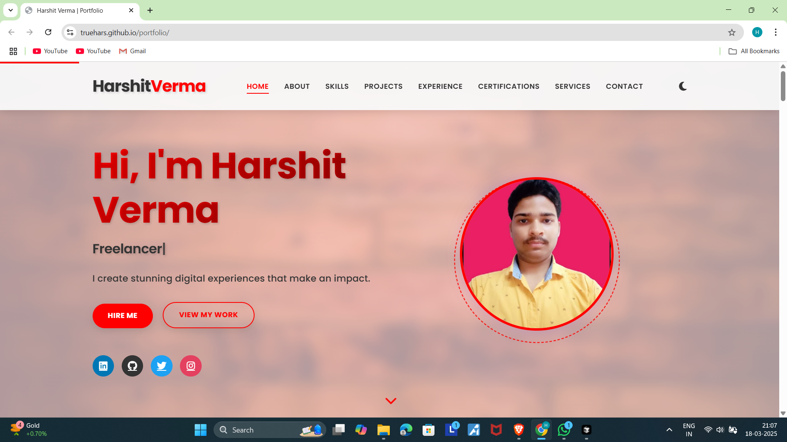

# 💼 Modern Portfolio - Harshit Verma

> A stunning, responsive portfolio website showcasing my skills, projects, and professional experience as a Web Developer & AI Agent Developer.



## ✨ Features

- **🌙 Dark/Light Theme Toggle** - Seamless theme switching with persistent preference
- **📱 Fully Responsive** - Works flawlessly on mobile, tablet, and desktop
- **⚡ Fast Performance** - Built with Vite for lightning-fast load times
- **🎨 Modern UI/UX** - Glassmorphism design with smooth animations
- **📊 Interactive Skills** - Visual skill proficiency indicators
- **🚀 Project Showcase** - Detailed project cards with links and ratings
- **💬 Contact Form** - Easy way to get in touch
- **🔍 SEO Optimized** - Better visibility on search engines

## 🛠️ Tech Stack

### Frontend
- **React 19** - Latest React for building dynamic UI
- **Vite 8** - Ultra-fast build tool and dev server
- **CSS3** - Modern styling with animations and gradients
- **JavaScript ES6+** - Clean, modern JavaScript

### Development
- **ESLint** - Code quality and consistency
- **Node.js** - JavaScript runtime

## 📦 Installation

1. **Clone the repository**
```bash
git clone https://github.com/Truehars/Modern_portfolio.git
cd Modern_portfolio/portfolio
```

2. **Install dependencies**
```bash
npm install
```

3. **Start development server**
```bash
npm run dev
```
Visit `http://localhost:5173` in your browser

## 🚀 Deployment

### Deploy to Netlify (Recommended)
1. Go to [Netlify](https://www.netlify.com)
2. Click "New site from Git"
3. Select your GitHub repo
4. Netlify auto-detects build settings and deploys automatically

### Deploy Manually
```bash
npm run build
npm install -g netlify-cli
netlify deploy --prod --dir=dist
```

## 📁 Project Structure

```
portfolio/
├── src/
│   ├── components/          # React components
│   │   ├── Header.jsx
│   │   ├── Hero.jsx
│   │   ├── About.jsx
│   │   ├── Skills.jsx
│   │   ├── Projects.jsx
│   │   ├── Experience.jsx
│   │   ├── Services.jsx
│   │   ├── Contact.jsx
│   │   └── Footer.jsx
│   ├── data/
│   │   └── portfolioData.js # All portfolio content
│   ├── assets/              # Images, fonts, SVGs
│   ├── App.jsx
│   ├── App.css
│   ├── main.jsx
│   └── index.css
├── public/
│   ├── images/              # Public images
│   └── icons.svg
├── index.html
├── package.json
├── vite.config.js
└── netlify.toml
```

## 💡 Key Sections

### 1. **Hero Section**
Welcoming introduction with call-to-action buttons

### 2. **About**
Professional bio and key highlights

### 3. **Skills**
- Technical Skills: HTML5, CSS3, JavaScript, React, Node.js, UI/UX
- Soft Skills: Communication, Teamwork, Problem Solving, etc.

### 4. **Projects**
Featured projects including:
- Invoice Validation Agent (AI/FastAPI)
- Vibe Todo List
- Fitness Tracker
- Travel Agency Redesign
- Personal Portfolio

### 5. **Experience**
- Current: Intern at WNS Global (AI Agent Development)
- Freelance Web Developer
- Previous internships and roles

### 6. **Services**
- Web Development
- Responsive Design
- UI/UX Design
- E-commerce Solutions
- API Development
- SEO Optimization

### 7. **Contact**
Easy contact form and social media links

## 🎯 Available Scripts

```bash
# Start development server
npm run dev

# Build for production
npm run build

# Preview production build
npm preview

# Lint code
npm run lint
```

## 📊 Performance

- ⚡ First Contentful Paint: < 1s
- 📦 Bundle Size: ~67KB (gzipped)
- 🎯 Lighthouse Score: 95+

## 🔗 Links & Social

- **LinkedIn**: [harshit-verma](https://www.linkedin.com/in/harshit-verma-4684ba260)
- **GitHub**: [Truehars](https://github.com/Truehars)
- **Twitter**: [@varma789ajay](https://x.com/varma789ajay)
- **Instagram**: [harshit_verm__a](https://www.instagram.com/harshit_verm__a)

## 📝 Customization

To customize the portfolio with your own data:

1. Edit `src/data/portfolioData.js` with your information:
   - Personal info, social links
   - Technical and soft skills
   - Projects and experience
   - Education and achievements

2. Add your images to `public/images/` and `src/assets/`

3. Update component styles in `src/components/*.css`

## 🎓 Education

- **Bachelor of Technology** - Raj Kumar Goel Institute of Technology (2022 - Present)
- **Higher Secondary** - Praxis Vidyapeeth (2022)

## 🏆 Achievements

- Built fullstack agentic AI workflow with multi-agent orchestration
- Created modern, responsive portfolio with 5.0★ rating
- Active open-source contributor
- Multiple technical certifications in web development and UI/UX

## 📄 License

This project is open source and available under the MIT License.

## 👨‍💻 Author

**Harshit Verma**  
Web Developer & AI Agent Developer  
📧 varma789ajay@gmail.com  
📱 +91 6306050027

---

**Made with ❤️ using React + Vite**

⭐ If you like this portfolio, please give it a star!
